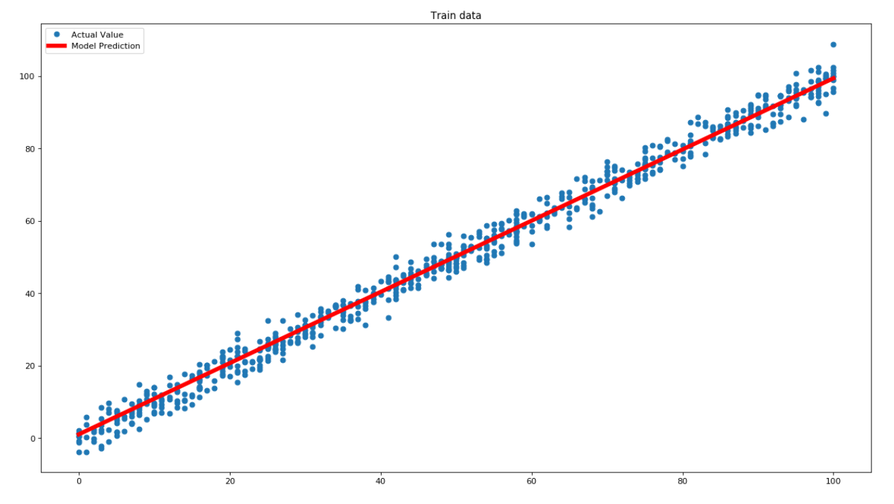
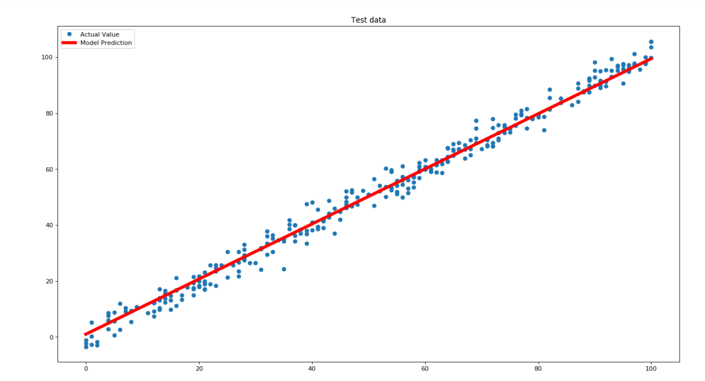

## Description

This is an implementation of linear regression on one independent parameter implemented in C++. I have used a very simple dataset for training the model.

## Results

Upon training this model on the dataset for 100000 iterations, we obtained a line given by the expression ```y = 0.984304x + 0.984304```. However, this result can be obtained with a much lower
number of iterations too.

> Here is a plot of the training data and our model prediction


> Here is a plot of the testing data and our model prediction


_As we can see our goal here has been accomplished!_
